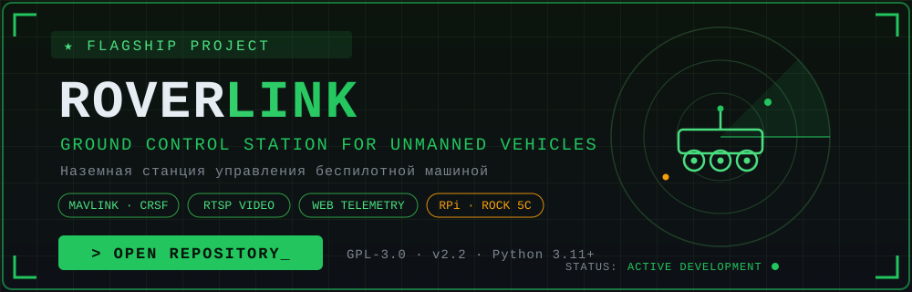

<div align="center">




</div>

```
┌──────────────────────────────────────────────────────────────┐
│  > whoami                                                    │
│  Dmitry Prokofev [XAKER] — Robotics Engineer                 │
│  > mission                                                   │
│  Building ground control systems for unmanned vehicles       │
│  > status                                                    │
│  ● ONLINE — LINK SECURE — MODE: AUTONOMOUS                   │
└──────────────────────────────────────────────────────────────┘
```

## `▌ ABOUT // О СЕБЕ`

**EN** — Robotics engineer focused on **unmanned ground vehicles (UGV)**. I design and build ground control stations that run on single-board computers — from protocol translation (MAVLink / CRSF / SBUS) and low-latency video pipelines to web-based control panels with real-time telemetry. Open-source core, commercial-grade reliability.

**RU** — Инженер-робототехник, специализируюсь на **беспилотных наземных машинах**. Проектирую и разрабатываю наземные станции управления на одноплатных компьютерах: трансляция протоколов (MAVLink / CRSF / SBUS), видеопотоки с низкой задержкой, веб-панель управления с телеметрией в реальном времени. Открытое ядро — надёжность коммерческого уровня.

```python
class RoboticsEngineer:
    name     = "Dmitry Prokofev"
    callsign = "XAKER"
    focus    = ["UGV", "ground control stations", "telemetry", "video streaming"]
    hardware = ["Raspberry Pi 4/5", "Radxa ROCK 5C", "ESP32", "flight controllers"]
    mission  = "reliable control links for unmanned machines"
```

## `▌ FLAGSHIP PROJECT // ФЛАГМАНСКИЙ ПРОЕКТ`

<div align="center">

<a href="https://github.com/xaker-enginer/roverlink">

</a>

</div>

### 🛰 RoverLink — Ground Control Station for UGVs

**EN** — A ground control station for unmanned ground vehicles running on single-board computers. Two operational modes: a virtual CRSF-based flight controller for ESP32-equipped machines, and a transparent MAVLink USB relay for full flight controllers. Unified codebase across three SBC platforms. Web control panel, real-time telemetry, RTSP video pipeline, ZeroTier remote access, Mission Planner integration, failsafe logic.

**RU** — Наземная станция управления беспилотной машиной на одноплатном компьютере. Два режима работы: виртуальный полётный контроллер на базе CRSF для машин с ESP32 и прозрачный MAVLink USB-ретранслятор для полноценных полётных контроллеров. Единая кодовая база для трёх платформ. Веб-панель управления, телеметрия в реальном времени, видеотракт RTSP, удалённый доступ через ZeroTier, интеграция с Mission Planner, отработка failsafe.

<div align="center">

[](https://github.com/xaker-enginer/roverlink)
[](https://github.com/xaker-enginer/roverlink/blob/main/LICENSE)


</div>

> ⚙️ **EN:** Core development happens in a private R&D repository; the open-source core is published under GPL-3.0 with a commercial branch offering extended per-device functionality.
> **RU:** Основная разработка ведётся в закрытом dev-репозитории; открытое ядро публикуется под GPL-3.0, коммерческая ветка даёт расширенную функциональность с активацией на устройство.

## `▌ TECH STACK // СТЕК`

<div align="center">

**` SOFTWARE `**


**` PROTOCOLS & COMMS `**


**` HARDWARE & OS `**


</div>

## `▌ TELEMETRY // СТАТИСТИКА`

<div align="center">


</div>

## `▌ COMMS // СВЯЗЬ`

<div align="center">

[](https://t.me/drmitry_haker)
[](mailto:dmitry@hauger-it.com)

<br/>

```
> EN: Open to collaboration on UGV / robotics / ground control projects.
> RU: Открыт к сотрудничеству по проектам UGV, робототехники и наземных станций управления.
```


</div>

<div align="center">
<sub><code>// end of transmission ●</code></sub>
</div>
